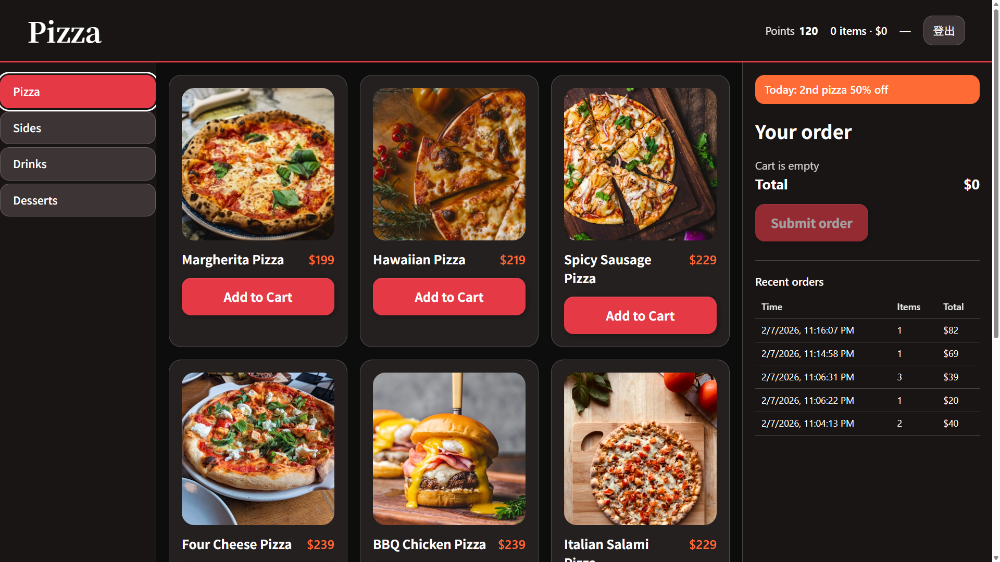
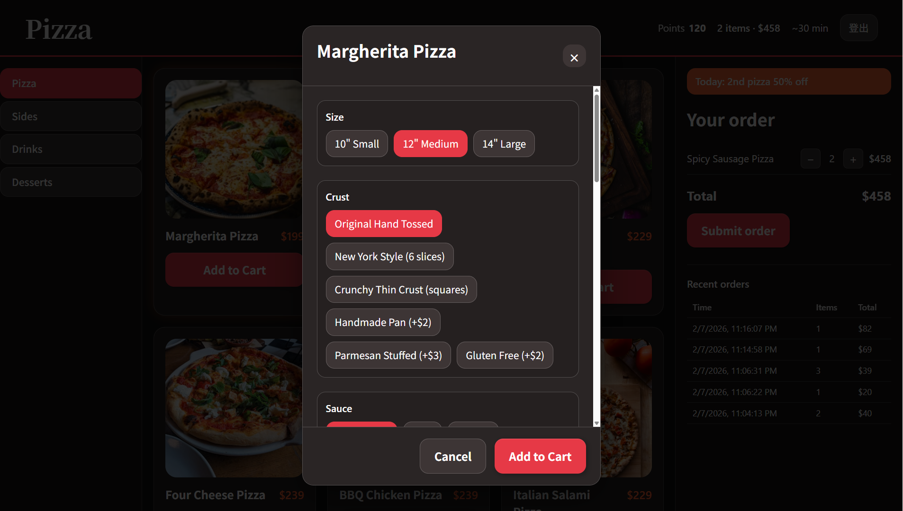

# PizzaShop Analytics System


A full-stack restaurant management system for operations statistics, ordering, and point-of-sale.

## Project Overview

This system is a monorepo containing:
- **`PizzaShop-BackEnd`**: A Node.js/Express backend with Prisma & PostgreSQL.
- **`PizzaShop-FrontEnd`**: A React monorepo using Turbo, containing Client, POS, Admin, and Landing apps.

---

## 🏗️ Architecture

### Frontend (`PizzaShop-FrontEnd`)

Built with **React 19**, **TypeScript**, **Vite**, **Tailwind CSS**, and **Turbo**.

| App | Path | Port | Purpose |
|-----|------|------|---------|
| **web** | `apps/web` | `5173` | **Unified Entry Point**. Handles login and redirects users based on their role (Admin, Staff, Client). |
| **client-web** | `apps/client-web` | - | **Customer Interface**. Allows customers to browse the menu, customize items (e.g., pizza toppings), and place orders. |
| **pos-web** | `apps/pos-web` | - | **Point of Sale (Staff)**. For staff to view incoming orders, update status, and manage table service. |
| **admin-web** | `apps/admin-web` | - | **Management Dashboard**. For owners to view analytics (revenue, turnover), manage menus, tables, and users. |

### 📸 Application Previews

**Client Ordering Interface**


**Pizza Customization**


### Backend (`PizzaShop-BackEnd`)

Built with **Node.js**, **Express**, **TypeScript**, and **Prisma**.

- **Database**: PostgreSQL (Production) or In-Memory (Dev/Testing).
- **ORM**: Prisma for schema management and type-safe database access.
- **Authentication**: JWT-based auth for Admin, Staff, and Client roles.

---

## 🚀 Key Features

### 1. Core Metrics & Analytics
The backend calculates key performance indicators (KPIs) essentially for restaurant management:
- **Table Turnover Rate**: Tracks seat efficiency (Parties served / Total tables).
- **Revenue per Table**: Helps in pricing and revenue optimization.
- **RevPASH (Revenue Per Available Seat Hour)**: Crucial for analyzing peak-period efficiency.
- **Popular Dishes**: Identifies top-selling items by diner count and quantity.
- **Labor Cost %**: (Future integration) For tracking staff efficiency.

### 2. Live Operations
- **Real-time Order Management**: Orders flow from Client -> Backend -> POS.
- **Table Management**: Status tracking (Free, Occupied, Reserved).
- **Menu Management**: Dynamic menu items with support for complex options (e.g., Pizza toppings).

### 3. Role-Based Access
- **Admin**: Full system access, analytics, and settings.
- **Staff**: POS access, order processing.
- **Client**: Menu viewing and ordering.

---

## 🛠️ Setup & Installation

### Prerequisites
- Node.js (Latest LTS recommended)
- PostgreSQL (for persistence)

### 1. Database Setup (Backend)
Navigate to `PizzaShop-BackEnd`:
1. Copy `.env.example` to `.env`:
   ```bash
   cp .env.example .env
   ```
2. Set `DATABASE_URL` in `.env`.
3. Run migrations and seed data:
   ```bash
   npm install
   npm run db:migrate
   npm run db:seed
   ```
   *Seeding creates default users: `admin@example.com`, `staff@example.com`, `client@example.com` (Password: `password123`)*

### 2. Start the Backend
```bash
npm run dev
# Server runs on http://localhost:3001
```

### 3. Start the Frontend
Navigate to `PizzaShop-FrontEnd`:
```bash
npm install
npm run dev
# Landing page runs on http://localhost:5173
```

---

## 🧪 How to Test

### Login Flow
1. Open `http://localhost:5173`.
2. Login with one of the test accounts:
   - **Admin**: Redirects to Admin Dashboard.
   - **Staff**: Redirects to POS.
   - **Client**: Redirects to Ordering App.

### API Testing (Backend)
- **POST /api/data/collect**: Submit operations data.
- **GET /api/data/history**: Fetch historical data with filters (`from`, `to`, `restaurantId`).

---

## 📂 Project Structure

```
OpenTable/
├── PizzaShop-BackEnd/    # Express API
│   ├── prisma/           # Schema & Migrations
│   └── src/              # Source code (Controllers, Services)
├── PizzaShop-FrontEnd/   # React Monorepo
│   ├── apps/
│   │   ├── web/          # Ops & Login
│   │   ├── client-web/   # Customer App
│   │   ├── pos-web/      # Staff App
│   │   └── admin-web/    # Admin Dashboard
│   └── packages/         # Shared UI/Config
└── README.md             # This file
```
